<div align="center">

# APR Xàtiva — Backend

**API REST para el sistema de control de acceso vehicular del Ajuntament de Xàtiva**

[](https://spring.io/projects/spring-boot)
[](https://openjdk.org)
[](https://mysql.com)
[](https://docker.com)

</div>

---

## ¿Qué es APR Xàtiva?

APR Xàtiva es un sistema de control de acceso vehicular desarrollado como Trabajo de Fin de Grado (DAM) y adoptado por el Ajuntament de Xàtiva como propuesta técnica. Permite gestionar qué vehículos pueden acceder a zonas restringidas de la ciudad, con un panel web para administradores y una app Android para los agentes de control.

🌐 **Panel web:** [github.com/ArocaDev/apr-xativa-frontend](https://github.com/ArocaDev/apr-xativa-frontend)  
📱 **App Android:** [github.com/ArocaDev/apr-xativa-android](https://github.com/ArocaDev/apr-xativa-android)

---

## ✨ Funcionalidades

- **Autenticación JWT** con access token (15 min) y refresh token (7 días)
- **Control de acceso vehicular** — consulta por matrícula con respuesta inmediata
- **Gestión de vehículos** — CRUD completo con roles y permisos
- **Gestión de usuarios** — roles ADMIN y AGENTE
- **Acceso puntual para invitados** — hasta 5 invitaciones mensuales por usuario
- **Simulador de acceso** — probabilidad 60/40 para testing
- **Auditoría asíncrona** — registro de todas las operaciones sin impacto en rendimiento
- **Rate limiting** con Bucket4j en endpoints sensibles
- **Paginación opcional** en listados
- **32 tests unitarios**
- **Documentación Swagger/OpenAPI 3.1**

---

## 🗂️ Diagramas

### Arquitectura del sistema


### Flujo de autenticación JWT


### Flujo de solicitud de acceso


---

## 🛠️ Stack técnico

| Capa | Tecnología |
|------|-----------|
| Framework | Spring Boot 4.0.5 |
| Lenguaje | Java 21 |
| Base de datos | MySQL 8 |
| ORM | Spring Data JPA / Hibernate |
| Auth | JWT (jjwt) |
| Rate limiting | Bucket4j |
| Auditoría | Spring Events (asíncrono) |
| Contenedores | Docker + Docker Compose |
| Documentación | Swagger / OpenAPI 3.1 |
| Tests | JUnit 5 + Mockito (32 tests) |

---

## 📁 Estructura del proyecto

```
apr-xativa-backend/
├── src/main/java/com/arocadev/apr/
│   ├── controller/
│   │   ├── AuthController.java
│   │   ├── VehiculoController.java
│   │   ├── UsuarioController.java
│   │   ├── AccesoController.java
│   │   └── AuditoriaController.java
│   ├── service/
│   ├── repository/
│   ├── model/
│   ├── dto/
│   ├── security/
│   │   ├── JwtUtil.java
│   │   ├── JwtFilter.java
│   │   └── RateLimitFilter.java
│   └── audit/
│       └── AuditListener.java
├── assets/
│   ├── diagrama_arquitectura.svg
│   ├── flux_autenticacion_jwt.svg
│   └── flux_solicitud_acceso.svg
├── docker-compose.yml
├── Dockerfile
├── .env.example
└── pom.xml
```

---

## 🚀 Instalación con Docker

```bash
git clone https://github.com/ArocaDev/apr-xativa-backend.git
cd apr-xativa-backend
cp .env.example .env
# Edita .env con tus credenciales
docker compose up --build -d
```

API disponible en `http://localhost:8080`  
Swagger en `http://localhost:8080/swagger-ui.html`

---

## 🚀 Instalación local

```bash
git clone https://github.com/ArocaDev/apr-xativa-backend.git
cd apr-xativa-backend
# Crea la base de datos MySQL
# Edita src/main/resources/application.properties
./mvnw spring-boot:run
```

---

## 🔑 Variables de entorno

```env
DB_URL=jdbc:mysql://localhost:3306/apr_xativa
DB_USERNAME=root
DB_PASSWORD=
JWT_SECRET=
JWT_EXPIRATION=900000
JWT_REFRESH_EXPIRATION=604800000
```

---

## 📡 Endpoints principales

| Método | Ruta | Descripción |
|--------|------|-------------|
| POST | `/api/auth/login` | Login → JWT |
| POST | `/api/auth/refresh` | Renovar token |
| GET | `/api/vehiculos` | Listar vehículos |
| POST | `/api/vehiculos` | Registrar vehículo |
| GET | `/api/vehiculos/{matricula}/acceso` | Consultar acceso |
| POST | `/api/acceso/invitado` | Acceso puntual invitado |
| GET | `/api/usuarios` | Listar usuarios (ADMIN) |
| GET | `/api/auditoria` | Log de auditoría (ADMIN) |

---

## 🧪 Tests

```bash
./mvnw test
```

32 tests unitarios con JUnit 5 + Mockito.

---

## 🗺️ Roadmap

- [x] Auth JWT con refresh token (15 min / 7 días)
- [x] Control de acceso vehicular por matrícula
- [x] Roles ADMIN y AGENTE
- [x] Acceso puntual para invitados (5/mes)
- [x] Simulador con probabilidad 60/40
- [x] Auditoría asíncrona
- [x] Rate limiting con Bucket4j
- [x] Paginación opcional
- [x] 32 tests unitarios
- [x] Swagger / OpenAPI 3.1
- [x] Docker Compose

---

## 🏆 Reconocimiento

Proyecto calificado con **10/10** y adoptado por el **Ajuntament de Xàtiva** como propuesta técnica oficial.

---

## 👤 Autor

**Alejandro Rodríguez Calabuig**  
[github.com/ArocaDev](https://github.com/ArocaDev) · [LinkedIn](https://www.linkedin.com/in/alejandro-rodriguez-calabuig-a871a1230)

---

## 📄 Licencia

Proyecto académico — no licenciado para uso comercial.
